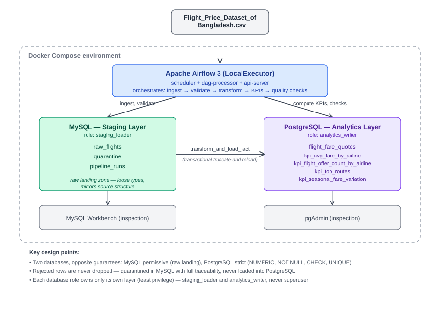

# System Architecture

This diagram shows the system as it actually runs: a static CSV, Apache
Airflow orchestrating every step, a MySQL staging layer that accepts data
raw, and a PostgreSQL analytics layer that only ever holds validated data.

The full reasoning behind this shape — why two databases, why the DAG has
the specific task structure it does, and what each least-privilege role is
allowed to do — is written out in detail in
[`final_report.md` §1](final_report.md#1-pipeline-architecture-and-execution-flow)
and [`MASTER_PLAN.md`](MASTER_PLAN.md#pipeline-architecture--why-two-databases).
This page exists to give a reader the picture at a glance before reading
either of those in full.

## Reading the diagram

- **CSV → Airflow**: the source file is read fresh on each manual run
  (`check_source_file` existence check, the schema sample, the checksum,
  and the full load each open it) — nothing is scheduled daily (ADR-001 —
  this is a static, one-time dataset, not incremental data).
- **Airflow ↔ MySQL (staging)**: bidirectional — Airflow writes during
  ingestion and validation, and reads back later for reconciliation.
  `raw_flights` holds the file as-is; `quarantine` holds every rejected row
  with full traceability back to its exact source position;
  `pipeline_runs` is the audit trail for every run.
- **MySQL → PostgreSQL**: the one genuinely one-directional arrow — real
  data movement inside `transform_and_load_fact`. The transaction guarantee
  here is on the PostgreSQL side only (`TRUNCATE` + inserts as one
  transaction, so a failure rolls back to the previous good contents) —
  the MySQL reads that feed it are separate, ordinary reads, not part of a
  distributed transaction spanning both databases.
- **Airflow ↔ PostgreSQL (analytics)**: also bidirectional — the four KPI
  tables are computed entirely in SQL, run by Airflow but executed by
  PostgreSQL itself against data already sitting in `flight_fare_quotes`
  (the ELT half of an otherwise-ETL pipeline, ADR-009), and Airflow reads
  back from here too for the post-load quality checks.
- **Same PostgreSQL instance, two databases**: the analytics data lives in
  `flight_analytics`, owned by `analytics_writer` — but the same Postgres
  container also hosts a separate `airflow` database, used only for
  Airflow's own metadata, with its own role (ADR-002). They're on the same
  server but never share a role or a schema.
- **Inspection tools**: pgAdmin is a real containerized service in
  `docker-compose.yml`. MySQL inspection is via `make mysql-shell` instead
  — there's no MySQL Workbench service in this project; it runs on the
  host, outside Docker entirely.

Each database role only owns its own layer — `staging_loader` cannot touch
PostgreSQL, `analytics_writer` cannot touch MySQL or Airflow's own metadata
database, and neither ever uses a superuser account.